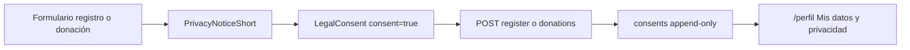

# Marco

El sitio trata **datos personales sensibles** (creencias religiosas inferidas del donativo). La
LFPDPPP exige aviso integral, aviso simplificado en el momento de la recolección, consentimiento
expreso para sensibles y mecanismos ARCO. Autoridad vigente: **Secretaría Anticorrupción y Buen
Gobierno** (no INAI).

# Fuente canónica de identidad

`utils/legal.ts` exporta `LEGAL`, `ARCO_DEADLINES` y `RETENTION`. Detalle de campos y cuándo
actualizarlos: [/legal/legal-config.md](/legal/legal-config.md). Todo texto legal que cite al
responsable debe leer de ahí, no duplicar valores a mano.

| Campo | Uso | Estado |
|-------|-----|--------|
| `razonSocial` | Aviso integral y simplificado | Confirmado |
| `domicilio` | Requisito Art. 21 | **Pendiente jurídico** |
| `correoArco` | Solicitudes ARCO y contacto privacidad | **Confirmar buzón dedicado** |
| `telefono` | Contacto | Confirmado |
| `noticeVersion` | Estampado en cada fila de `consents` | `2026-09-09` |
| `noticeDate` | Fecha legible en el aviso | `9 de septiembre de 2026` |
| `autoridad` | Procedimiento de protección de derechos | Confirmado |

# Páginas

| Ruta | Archivo | Contenido |
|------|---------|-----------|
| `/privacidad` | `pages/privacidad/index.vue` | Aviso integral (10 secciones Art. 21) |
| `/terminos` | `pages/terminos/index.vue` | Términos de uso del sitio |

El cuerpo largo vive en el componente de página (documento versionado como unidad). Las cadenas
cortas de UI van a `legal.*` en `i18n/locales/es-MX.json`. Ver
[/decisions/contenido-legal-en-paginas.md](/decisions/contenido-legal-en-paginas.md).

# Componentes reutilizables

| Componente | Dónde se monta | Rol |
|------------|----------------|-----|
| `PrivacyNoticeShort.vue` | `/registro`, `/donaciones` | Aviso simplificado obligatorio |
| `LegalConsent.vue` | `/registro`, `/donaciones` | Casilla expresa (nunca premarcada) |
| `AppFooter.vue` | Todas las páginas | Enlaces a `/privacidad` y `/terminos` |

En registro incluye casilla opcional de comunicaciones (`marketing`). En donación solo la casilla
obligatoria de sensibles + aviso.

# Flujo de consentimiento

Validación en servidor: `consent === true` o respuesta `422`. Detalle en
[/decisions/consentimiento-datos-sensibles.md](/decisions/consentimiento-datos-sensibles.md) y
[/data/consents-table.md](/data/consents-table.md).

# Derechos ARCO en producto

| Derecho | Superficie | API |
|---------|------------|-----|
| Acceso | Descargar mis datos en `/perfil` | `GET /api/me/export` |
| Rectificación | Editar perfil | `PATCH /api/me` |
| Cancelación | Eliminar cuenta (con contraseña) | `DELETE /api/me` |
| Oposición / revocación | Interruptor comunicaciones | `POST /api/me/consents` |

Canal alternativo por correo a `LEGAL.correoArco` documentado en sección 5 del aviso integral.
Plazos: `ARCO_DEADLINES` en `utils/legal.ts`.

# Geolocalización

`/iglesias` ya no pide ubicación en `onMounted`. El botón «Usar mi ubicación» explica que las
coordenadas se envían a `universal.org.mx`. Sin permiso se usan defaults de `nuxt.config.ts`.
Ver inventario: [/data/personal-data-inventory.md](/data/personal-data-inventory.md).

# Cómo actualizar el aviso

1. Editar `pages/privacidad/index.vue` (y `/terminos` si aplica).
2. Subir `LEGAL.noticeVersion` y `LEGAL.noticeDate` en `utils/legal.ts`.
3. Si cambian finalidades del tratamiento, el consentimiento previo **no** se da por válido: los
   usuarios deben aceptar de nuevo en el próximo registro o donación.
4. Actualizar `RETENTION` si cambian plazos; reflejar en sección 6 del aviso.
5. Actualizar [/data/personal-data-inventory.md](/data/personal-data-inventory.md) si cambia el
   inventario de datos.
6. Entrada en [/log.md](/log.md).

Regla operativa para desarrolladores: `.cursor/rules/pii-handling.mdc`.

# Checklist pre-publicación

- [ ] `LEGAL.domicilio` confirmado por jurídico (no dejar marcador).
- [ ] `LEGAL.correoArco` es buzón dedicado y monitoreado.
- [ ] Revisión jurídica del texto integral y términos (borrador técnico ≠ asesoría legal).
- [ ] `/privacidad` y `/terminos` responden 200; enlaces visibles en el pie.
- [ ] Registro y donación bloquean envío sin casilla; API devuelve `422` sin `consent`.
- [ ] `/perfil` permite descargar, revocar marketing y eliminar cuenta.
- [ ] Migración `0002_swift_salo` aplicada (`consents`, `wants_receipt`).
- [ ] Smoke post-deploy incluye flujo de privacidad (ver [/playbooks/deploy.md](/playbooks/deploy.md)).

# Relacionados

- [/security/layers.md](/security/layers.md) — rate limiting y controles técnicos
- [/apis/me-export.md](/apis/me-export.md), [/apis/me-delete.md](/apis/me-delete.md), [/apis/me-consents.md](/apis/me-consents.md)
